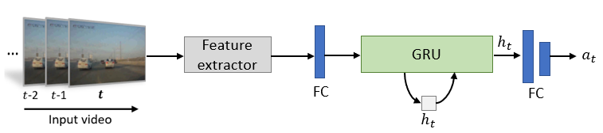

# simple-accident-prediction
## Overview
This is an implementation of a very simple accident prediction model that uses Gated Recurrent Unit (GRU) to predict an accident. The architecture of the model is developed with PyTorch. 
The input video frames are passed trough a CNN feature extractor (eg. ResNet50/VGG16), then the spatio-temporal relations of the extracted features are learnt using the GRU to predict the accident probablity of each video frame. The architecture is as below:

  

## Dataset
This code supports Street Accident (SA) Dataset (also known as DAD dataset). The video dataset needs to be converted into frames to train and test the network. 
> * Please download the frames from [here](https://bit.ly/3snfCAO). Note that, downloaded datasets needs to be put inside the folder `data/`
> * (Optional) Original video can be downloaded from the [SA official](https://github.com/smallcorgi/Anticipating-Accidents).

## Requirement
* Pytorch >=1.2
* torchvision >= 0.4
* tqdm
* tensorboardX
* numpy
* natsort
* opencv-python >= 4.1.1.26
* Pillow

## Getting started
* Install the required dependencies
* Clone this repository by typing:
~~~~
git clone https://github.com/monjurulkarim/simple-accident-prediction
~~~~
* Download the dataset and put it inside `data`

### Training
To train the network on you terminal type:
~~~~
python train.py
~~~~

### Testing
* This repository also integrated grad-cam tool to generate class acitavation maps. Grad-cam needs to be installed first to use this module.
~~~~
pip install grad-cam==1.3.1
~~~~
To visualize the grad-cam result: 
~~~~
python demo.py
~~~~
(To see the prediction score, one block of code needs to be uncommented first. Instruction can be found inside the code)

## Acknowledgement
1. PyTorch library for CAM methods. https://github.com/jacobgil/pytorch-grad-cam

